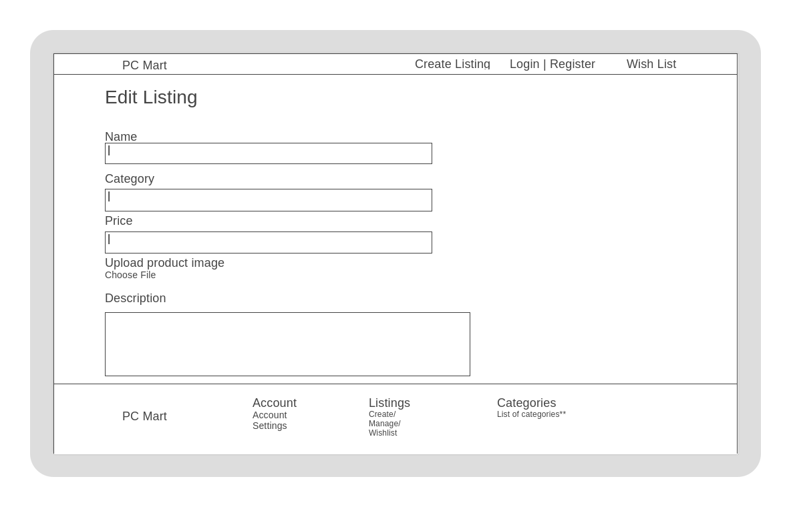
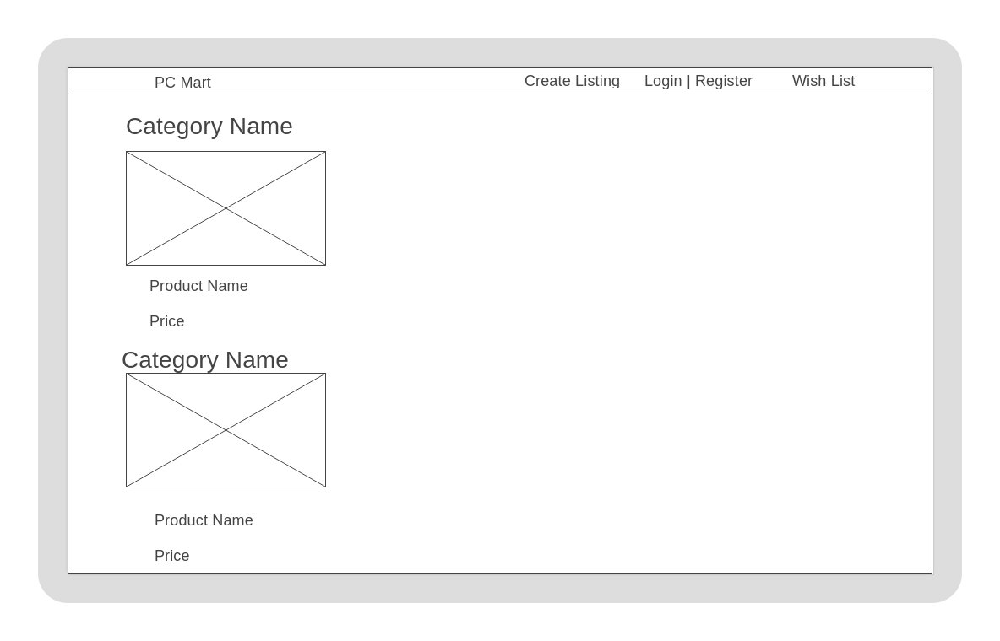
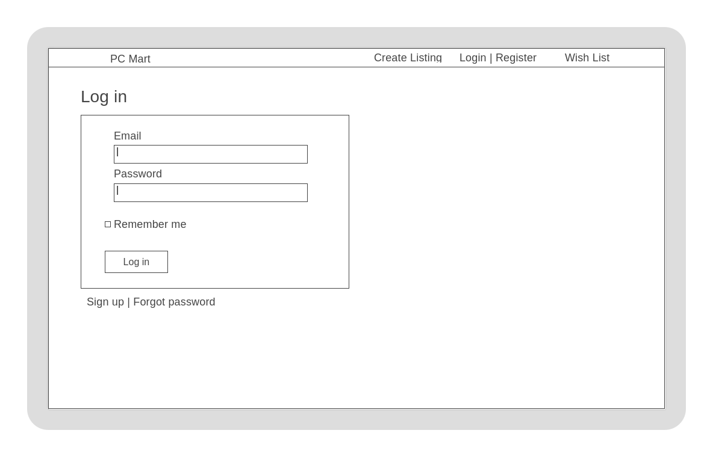
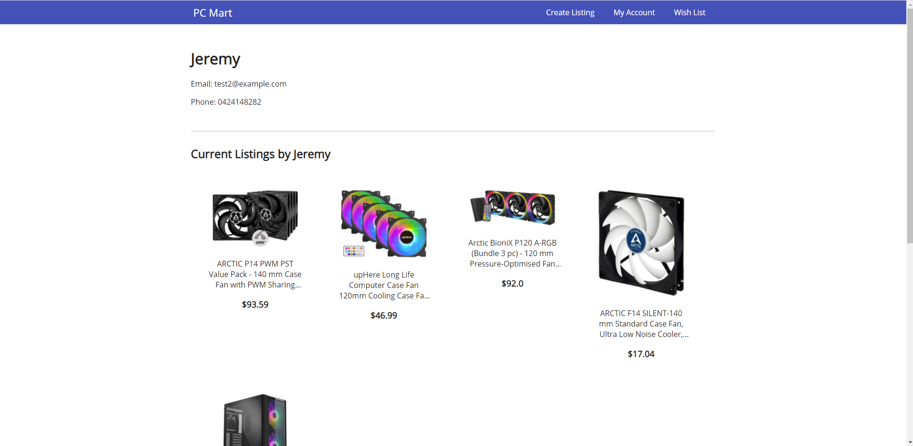

# Jeremy Tuesley - Term 2 Assessment 2

## Table of Contents:

- [Purpose for Creating](#Purpose)
- [Links](#Links)
- [Description](#Description)
- [Abstractions](#Abstractions)
- [Third Party Services](#Third-Party-Services)
- [User Stories](#User-Stories)
- [How Tasks are Tracked/ Allocated](#Task-Tracking)
- [Wireframes](#Wireframes)
- [Screenshots](#Screenshots)
- [Project Model Relationships](#Project-Model-Relationships)
- [Entity Relationship Diagram (ERD)](#ERD)
- [Database Relations](#Database-Relations)
- [Database Schema Design](#Database-Schema-Design)

#
## Links

* [GitHub Repository](https://github.com/jeremytuesley/PCMarketplace)
* [Trello Board](https://trello.com/b/BIHJOwcH/pc-mart-project-management)
* [Website](https://pc-mart.herokuapp.com)

#
## Description
### Purpose
PC Mart is a Marketplace where users can buy listed items/ sell items they listed, with the items being used computer parts
 (Like Gumtree but solely for PC Parts)  
Making due to parts usually being overpriced because people that don't know about PC's get charged more.

### Some features & functionality it has:
- Users can log in/ log out, sign up etc. Have their own accounts
- Users can add/ delete *their own* listings
- Users can add/ delete items to a personal wishlist
- Users can edit their own info
- Users will only be able to edit/ delete their own listings
- Navigation Bar
- Footer
- Single image uploading

### Sitemap

### Target audience
This website was designed for users who are computer enthusiasts/ people looking to build/ upgrade their own computers.

### Tech stack
Front-end: HTML, SCSS - CSS
Database: PostgreSQL
Back-end: Ruby on Rails
Deployment: Heroku
Source Control: GitHub

#
## Abstractions
- Category
  - name
- Product
  - name
  - description
  - price
  - user (user_id)
- User
  - email
  - password
  - name
  - phone
- Wishlist
  - (user_id)
  - (product_id)

#
## Third Party Services
- Google Fonts
- Heroku
- Cloudinary

#
## User Stories
### User (universal)
- As a user, I want to be able to edit my user information.
- As a user, I want to be able to sign out.

### Buyer
- As a buyer, I want to be able to view seller's contact infomation.
- As a buyer, I want to be able to see listings.

### Seller
- As a seller, I want my contact info to only be shown to people that have signed up with the website.
- As a seller, I want to be able to create more listings.
- As a seller, I want to be able to delete my own listings.
- As a seller, I want to be able to edit my own listings.

### Non-user (not signed up/ logged in)
- As a non-user, I want to be able to see listings before I sign up.
- As a non-user, I want to be able to sign-up/ log in.

#
## Task Tracking
For the tracking and time management for this app, I used a [Trello board](https://trello.com/b/BIHJOwcH/pc-mart-project-management).

#
## Wireframes
Below are wireframes for the website, desktop pictured first then tablet, then mobile

### Homepage

### Create Listing Page

### Edit Listing Page

### Category Page

### My Account Page

### Edit Account Page

### Wishlist Page

### Login Page

### Signup Page

### Screenshots

#
## Project Model Relationships
Category Model
- Category is used as a reference in the product table and just contains its name
- Categories can contain zero or many products, but each product only belongs to one category

Product Model
- Each product contains a user_id(FK) and a category_id(FK), products can have one and only one of each category, and user.
- Products contain a description, name, and price
- Products can be in zero or many wishlists, but each wishlist can only hold one of of the same product.

User Model
- Users can have zero or many products/ wishlists, and their ID gets referenced in both.
- Wishlists and products may only have one and only one user
- When a user is deleted from the database, their wishlist is deleted as well.
- When a user is deleted from the database, the associated products of theirs is also deleted

Wishlist Model
- Wishlist serves as a join table between user and product, having and one and only one outgoing relationship with both
- The wishlist join table has a zero or many incoming from users and products.

#
## ERD

#
## Database Relations
As per the ERD, the database relations are as follows:

### User and:
Products have a 'one and only one' to a 'zero or many' relationship.
- Each product may only have one user
- Each user can have either zero products or many products

Wishlist have a 'one and only one' to a 'zero or many' relationship.
- Each wishlist may only have one user
- Wishlist serves as a join table between user and products as a many to many relationship.

### Product and:
Wishlist have a 'one and only one' to a 'zero or many' relationship.
- Each wishlist can only contain one of the same product.
- Each product can be in zero or many wishlists.

Category have a 'zero or many' to a 'one and only one' relationship.
- Each category can contain zero or many products.
- Each product can belong to only one category.

#
## Database Schema Design
The database schema is designed according to the ERD. There are 4 tables (Category, Product, User, Wishlist). Each table is generated as a model in Ruby on Rails, the data type of each attribute/ column are specified. The foreign key columns are noted as references when the model is generated, for example user_id is a foreign key in the product table, when generating a product, the user_id is set as the reference to indicate that the product belongs to a user, and a relationship between a user and a product is set in the product model where each product has one user.
